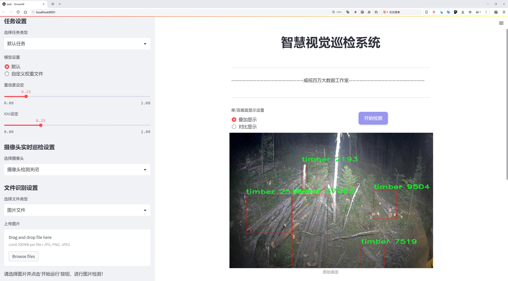
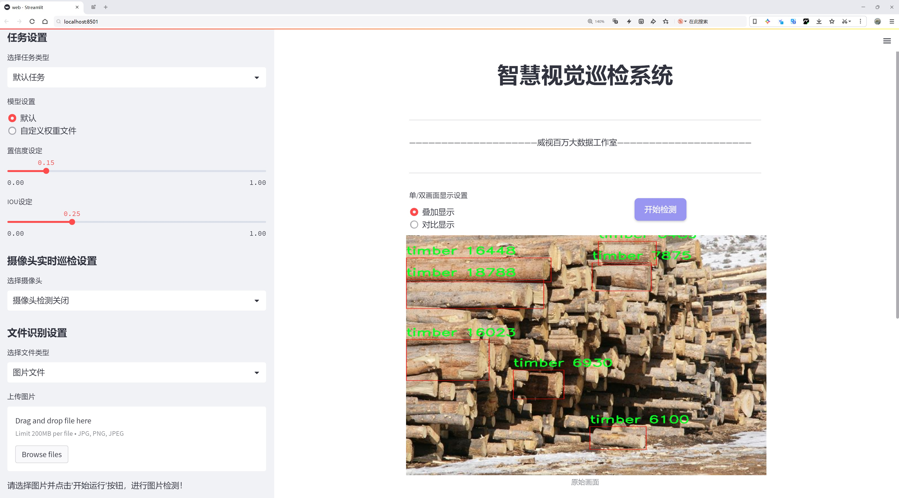
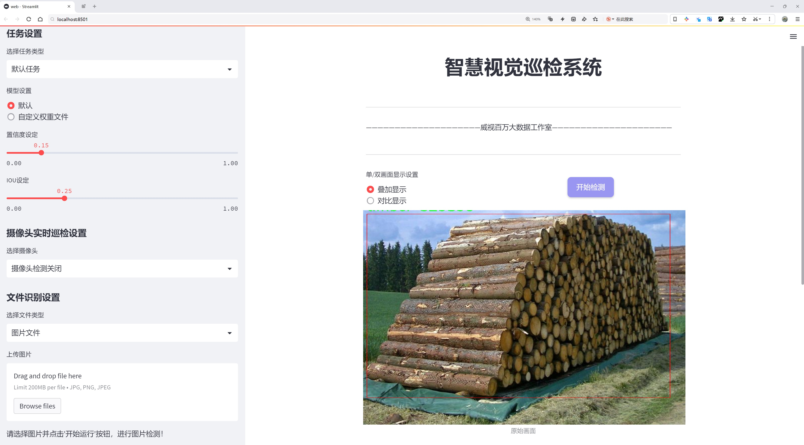
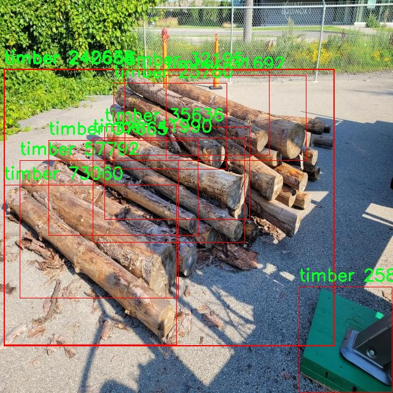
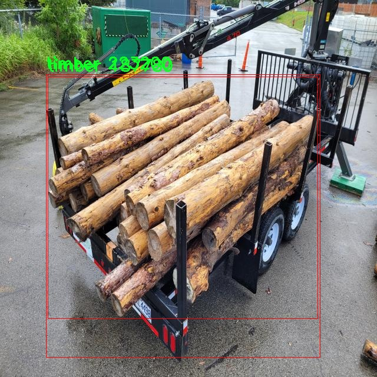
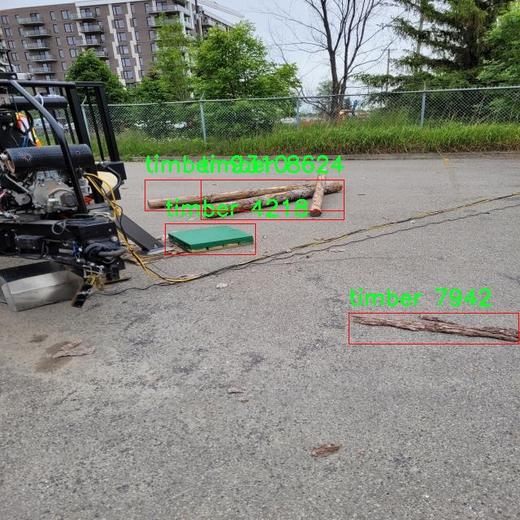
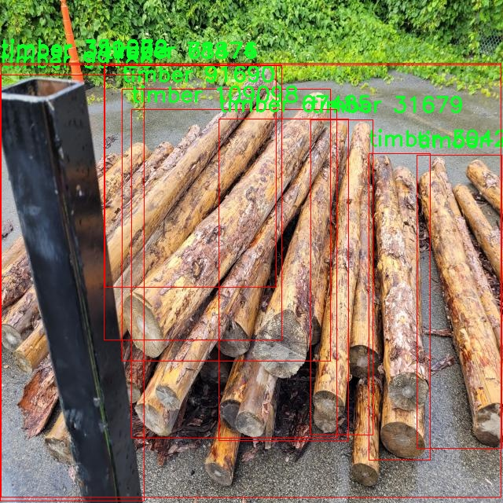

# 木材检测检测系统源码分享
 # [一条龙教学YOLOV8标注好的数据集一键训练_70+全套改进创新点发刊_Web前端展示]

### 1.研究背景与意义

项目参考[AAAI Association for the Advancement of Artificial Intelligence](https://gitee.com/qunmasj/projects)

项目来源[AACV Association for the Advancement of Computer Vision](https://kdocs.cn/l/cszuIiCKVNis)

研究背景与意义

随着全球经济的快速发展，木材作为一种重要的建筑和工业原材料，其需求量持续上升。然而，木材资源的过度开发和不合理利用，导致了森林资源的急剧减少和生态环境的恶化。因此，如何有效地进行木材的检测与管理，成为了当前木材行业亟待解决的重要问题。传统的木材检测方法多依赖人工检验，不仅效率低下，而且容易受到人为因素的影响，导致检测结果的不准确性和不一致性。随着计算机视觉和深度学习技术的迅猛发展，基于图像识别的自动化检测系统逐渐成为木材检测领域的研究热点。

YOLO（You Only Look Once）系列模型因其高效的实时目标检测能力，广泛应用于各类物体识别任务中。YOLOv8作为该系列的最新版本，结合了更为先进的网络结构和优化算法，能够在保持高精度的同时，实现更快的检测速度。针对木材检测的需求，基于改进YOLOv8的木材检测系统的研究，不仅能够提升木材检测的自动化水平，还能在一定程度上降低人工成本，提高检测的准确性和效率。

本研究所使用的数据集“woodtotal-31-3”包含2400张木材图像，专注于单一类别的木材（timber）检测。这一数据集的构建为木材检测系统的训练和评估提供了坚实的基础。通过对这些图像的深入分析与处理，研究者可以有效地提取木材的特征信息，进而优化YOLOv8模型的参数设置，提升其在木材检测任务中的表现。此外，数据集的规模和类别的单一性，使得模型能够专注于木材特征的学习，从而提高检测的准确率和鲁棒性。

研究的意义不仅体现在技术层面，更在于其对木材行业的实际应用价值。通过构建基于改进YOLOv8的木材检测系统，可以为木材生产、加工和流通环节提供高效的检测工具，帮助企业实现智能化管理。同时，该系统的推广应用，有助于提高木材资源的利用效率，降低资源浪费，促进可持续发展。此外，研究成果还可为其他领域的目标检测提供借鉴，推动计算机视觉技术在更多行业的应用。

综上所述，基于改进YOLOv8的木材检测系统的研究，不仅具有重要的学术价值，也对实际生产和环境保护具有深远的意义。通过该研究，期望能够为木材行业的智能化转型提供有力支持，为实现生态平衡和可持续发展贡献一份力量。

### 2.图片演示







##### 注意：由于此博客编辑较早，上面“2.图片演示”和“3.视频演示”展示的系统图片或者视频可能为老版本，新版本在老版本的基础上升级如下：（实际效果以升级的新版本为准）

  （1）适配了YOLOV8的“目标检测”模型和“实例分割”模型，通过加载相应的权重（.pt）文件即可自适应加载模型。

  （2）支持“图片识别”、“视频识别”、“摄像头实时识别”三种识别模式。

  （3）支持“图片识别”、“视频识别”、“摄像头实时识别”三种识别结果保存导出，解决手动导出（容易卡顿出现爆内存）存在的问题，识别完自动保存结果并导出到tempDir中。

  （4）支持Web前端系统中的标题、背景图等自定义修改，后面提供修改教程。

  另外本项目提供训练的数据集和训练教程,暂不提供权重文件（best.pt）,需要您按照教程进行训练后实现图片演示和Web前端界面演示的效果。

### 3.视频演示

[3.1 视频演示](https://www.bilibili.com/video/BV1m2xPeEEUb/)

### 4.数据集信息展示

##### 4.1 本项目数据集详细数据（类别数＆类别名）

nc: 1
names: ['timber']


##### 4.2 本项目数据集信息介绍

数据集信息展示

在本研究中，我们使用的数据集名为“woodtotal-31-3”，该数据集专门为改进YOLOv8的木材检测系统而设计。数据集的构建旨在为木材检测提供高质量的训练样本，以提高模型在实际应用中的准确性和鲁棒性。该数据集包含一个类别，即“timber”，这是木材检测的核心目标。通过专注于这一单一类别，我们能够深入挖掘木材的各种特征，从而为YOLOv8模型的训练提供更为精准和高效的数据支持。

“woodtotal-31-3”数据集的构建过程涉及了多种木材样本的收集和标注。数据集中的图像来源于不同的环境和条件，包括自然光照、不同的背景以及各种木材类型。这种多样性确保了模型在面对真实世界中的复杂场景时，能够保持较高的识别率和准确性。数据集中的每一张图像都经过精心标注，确保“timber”类别的目标物体能够被准确识别和定位。这种高质量的标注不仅提高了训练效果，也为后续的模型评估提供了可靠的基准。

在数据集的规模方面，“woodtotal-31-3”包含了丰富的样本量，这为YOLOv8模型的训练提供了充分的数据支持。通过使用大规模的数据集，模型能够学习到更多的特征和模式，从而提升其在木材检测任务中的表现。此外，数据集还包含了不同角度、不同距离和不同尺寸的木材图像，这些因素都可能影响检测的准确性。因此，数据集的多样性和丰富性使得模型能够更好地适应各种检测场景。

在数据预处理阶段，我们对“woodtotal-31-3”数据集进行了必要的图像增强和标准化处理。这些处理包括图像的缩放、旋转、裁剪以及亮度和对比度的调整，旨在提高模型的泛化能力。通过这些技术手段，我们能够确保模型在训练过程中不仅仅依赖于特定的图像特征，而是能够学习到更为广泛的木材特征。这种增强策略有效地减少了模型的过拟合风险，使其在测试集上的表现更加稳定。

此外，数据集的使用还涉及到对YOLOv8模型的超参数调整和优化。通过不断地迭代训练和验证，我们能够找到最佳的模型配置，以实现木材检测的最佳效果。在这一过程中，“woodtotal-31-3”数据集的反馈为模型的改进提供了重要依据，使得每一次训练都能够朝着更高的准确率和更低的误报率迈进。

综上所述，“woodtotal-31-3”数据集为改进YOLOv8的木材检测系统提供了坚实的基础。通过高质量的样本、丰富的标注和有效的数据预处理，该数据集不仅提升了模型的训练效果，也为实际应用中的木材检测提供了强有力的支持。未来，我们将继续探索数据集的扩展和优化，以进一步提升木材检测系统的性能和适应性。










### 5.全套项目环境部署视频教程（零基础手把手教学）

[5.1 环境部署教程链接（零基础手把手教学）](https://www.ixigua.com/7404473917358506534?logTag=c807d0cbc21c0ef59de5)


[5.2 安装Python虚拟环境创建和依赖库安装视频教程链接（零基础手把手教学）](https://www.ixigua.com/7404474678003106304?logTag=1f1041108cd1f708b01a)

### 6.手把手YOLOV8训练视频教程（零基础小白有手就能学会）

[6.1 手把手YOLOV8训练视频教程（零基础小白有手就能学会）](https://www.ixigua.com/7404477157818401292?logTag=d31a2dfd1983c9668658)

### 7.70+种全套YOLOV8创新点代码加载调参视频教程（一键加载写好的改进模型的配置文件）

[7.1 70+种全套YOLOV8创新点代码加载调参视频教程（一键加载写好的改进模型的配置文件）](https://www.ixigua.com/7404478314661806627?logTag=29066f8288e3f4eea3a4)

### 8.70+种全套YOLOV8创新点原理讲解（非科班也可以轻松写刊发刊，V10版本正在科研待更新）

由于篇幅限制，每个创新点的具体原理讲解就不一一展开，具体见下列网址中的创新点对应子项目的技术原理博客网址【Blog】：


[8.1 70+种全套YOLOV8创新点原理讲解链接](https://gitee.com/qunmasj/good)

### 9.系统功能展示（检测对象为举例，实际内容以本项目数据集为准）

图9.1.系统支持检测结果表格显示

  图9.2.系统支持置信度和IOU阈值手动调节

  图9.3.系统支持自定义加载权重文件best.pt(需要你通过步骤5中训练获得)

  图9.4.系统支持摄像头实时识别

  图9.5.系统支持图片识别

  图9.6.系统支持视频识别

  图9.7.系统支持识别结果文件自动保存

  图9.8.系统支持Excel导出检测结果数据


### 10.原始YOLOV8算法原理

原始YOLOv8算法原理

YOLOv8算法是目标检测领域的最新进展，标志着YOLO系列模型的又一次重大创新。作为一种实时目标检测模型，YOLOv8在保持高效性的同时，显著提升了检测精度，尤其是在复杂场景下的表现。其架构设计包括输入层、主干网络、颈部网络和头部网络，形成了一个完整的处理流程。输入图像首先被缩放至指定尺寸，以适应网络的输入要求。接下来，主干网络通过一系列卷积操作对图像进行下采样，提取出丰富的特征信息。

在YOLOv8的主干网络中，采用了CSP（Cross Stage Partial）结构，这一设计将特征提取过程分为两个部分，分别进行卷积和连接，从而有效地减少了计算量并提升了特征的表达能力。每个卷积层不仅包含批归一化（Batch Normalization），还使用了SiLU（Sigmoid Linear Unit）激活函数，这种激活函数在处理梯度时表现出色，有助于缓解梯度消失的问题。在特征提取的最后阶段，YOLOv8引入了SPPF（Spatial Pyramid Pooling Fast）模块，通过三个最大池化层处理多尺度特征，进一步增强了网络的特征抽象能力，使得模型能够更好地适应不同大小的目标。

YOLOv8的颈部网络采用了PAN-FPN（Path Aggregation Network - Feature Pyramid Network）结构，旨在融合来自不同尺度的特征图信息。通过这种结构，YOLOv8能够有效地整合低层次的细节特征与高层次的语义特征，从而提升检测的准确性和鲁棒性。PAN-FPN的设计不仅增强了特征的多尺度融合能力，还为后续的检测任务提供了更加丰富的信息。

在检测网络部分，YOLOv8引入了创新的解耦合头结构。这一结构将分类和回归任务分开处理，分别通过两个并行的卷积分支进行计算。这种设计的优势在于，它能够更好地优化每个任务的损失函数，从而提高整体的检测性能。此外，YOLOv8摒弃了传统的Anchor-Based方法，转而采用Anchor-Free的检测方式。这一转变使得模型在处理不同形状和大小的目标时更加灵活，减少了对先验框的依赖，提升了检测的准确性。

在训练过程中，YOLOv8采用了一系列数据增强技术，以提高模型的泛化能力。其中，马赛克增强技术在训练的最后10个epoch被关闭，这一策略旨在减少训练后期的噪声干扰，从而使模型更专注于学习重要特征。同时，YOLOv8还引入了动态Task-Aligned Assigner样本分配策略，旨在根据任务的不同阶段动态调整样本的分配，提高训练效率。

在损失计算方面，YOLOv8采用了BCELoss（Binary Cross Entropy Loss）作为分类损失，DFLLoss（Distance Focal Loss）和CIoULoss（Complete Intersection over Union Loss）作为回归损失。这种多样化的损失函数设计，使得模型在面对不同类型的目标时，能够更有效地优化其检测性能。

YOLOv8模型的多样性体现在其提供了多种尺度的版本，包括YOLOv8n、YOLOv8s、YOLOv8m、YOLOv8l和YOLOv8x。这些不同尺度的模型是根据特定场景的需求进行设计的，旨在在不同的计算资源和应用场景下，提供最佳的性能表现。YOLOv8n作为其中的最小模型，尽管在规模上有所限制，但依然展现出强大的特征提取和目标检测能力。

总的来说，YOLOv8算法通过对网络结构的精心设计和创新，成功地在目标检测领域实现了高效性与准确性的平衡。其主干网络的特征提取能力、颈部网络的特征融合策略以及解耦合头的设计，都为YOLOv8在复杂场景下的应用奠定了坚实的基础。随着YOLOv8的推广和应用，未来在自动驾驶、安防监控、智能制造等领域的目标检测任务中，YOLOv8无疑将发挥重要的作用。


### 11.项目核心源码讲解（再也不用担心看不懂代码逻辑）

#### 11.1 ui.py

以下是对代码的核心部分进行保留和详细注释的版本：

```python
import sys
import subprocess

def run_script(script_path):
    """
    使用当前 Python 环境运行指定的脚本。

    Args:
        script_path (str): 要运行的脚本路径

    Returns:
        None
    """
    # 获取当前 Python 解释器的路径
    python_path = sys.executable

    # 构建运行命令，使用 streamlit 运行指定的脚本
    command = f'"{python_path}" -m streamlit run "{script_path}"'

    # 执行命令，并等待其完成
    result = subprocess.run(command, shell=True)
    
    # 检查命令执行的返回码，如果不为0，表示执行出错
    if result.returncode != 0:
        print("脚本运行出错。")

# 实例化并运行应用
if __name__ == "__main__":
    # 指定要运行的脚本路径
    script_path = "web.py"  # 这里可以直接指定脚本名，假设在当前目录下

    # 调用函数运行脚本
    run_script(script_path)
```

### 代码核心部分分析：
1. **导入模块**：
   - `sys`：用于获取当前 Python 解释器的路径。
   - `subprocess`：用于执行外部命令。

2. **`run_script` 函数**：
   - 接收一个脚本路径作为参数。
   - 获取当前 Python 解释器的路径，并构建运行 `streamlit` 的命令。
   - 使用 `subprocess.run` 执行命令，并检查返回码以判断脚本是否成功运行。

3. **主程序入口**：
   - 在 `__main__` 模块中，指定要运行的脚本路径（`web.py`）。
   - 调用 `run_script` 函数执行指定的脚本。

### 代码的功能：
该代码的主要功能是使用当前 Python 环境运行一个名为 `web.py` 的脚本，利用 `streamlit` 库来启动一个 Web 应用。通过检查返回码，代码能够判断脚本是否成功执行，并在出现错误时给出提示。

这个文件名为 `ui.py`，它的主要功能是运行一个指定的 Python 脚本，具体来说是使用 Streamlit 框架来启动一个 Web 应用。代码的结构相对简单，主要由几个部分组成。

首先，文件导入了一些必要的模块，包括 `sys`、`os` 和 `subprocess`。其中，`sys` 模块用于访问与 Python 解释器相关的变量和函数，`os` 模块提供了与操作系统交互的功能，而 `subprocess` 模块则用于执行外部命令。

接下来，代码定义了一个名为 `run_script` 的函数。这个函数接收一个参数 `script_path`，它是要运行的脚本的路径。在函数内部，首先获取当前 Python 解释器的路径，这通过 `sys.executable` 实现。然后，构建一个命令字符串，该命令用于运行指定的脚本，具体是通过 Streamlit 的 `run` 命令来启动 Web 应用。

在构建完命令后，使用 `subprocess.run` 方法来执行这个命令。这个方法会在一个新的 shell 中运行命令，并等待其完成。如果命令执行的返回码不为 0，表示运行过程中出现了错误，程序会打印出“脚本运行出错”的提示信息。

最后，代码的执行入口是 `if __name__ == "__main__":` 这一行，这意味着当这个文件作为主程序运行时，以下代码块会被执行。在这个代码块中，首先指定了要运行的脚本路径，这里使用了 `abs_path` 函数来获取 `web.py` 的绝对路径。然后，调用 `run_script` 函数来执行这个脚本。

总体来说，这个文件的主要功能是提供一个简单的接口，通过命令行启动一个 Streamlit Web 应用，方便用户在本地运行相关的 Python 脚本。

#### 11.2 code\ultralytics\utils\checks.py

以下是代码中最核心的部分，并附上详细的中文注释：

```python
def parse_requirements(file_path=ROOT.parent / "requirements.txt", package=""):
    """
    解析 requirements.txt 文件，忽略以 '#' 开头的行和 '#' 后的任何文本。

    参数:
        file_path (Path): requirements.txt 文件的路径。
        package (str, optional): 要使用的 Python 包名，如果提供，则使用该包的依赖项。

    返回:
        (List[Dict[str, str]]): 解析后的依赖项列表，每个依赖项以字典形式表示，包含 `name` 和 `specifier` 键。
    """
    if package:
        # 如果提供了包名，则获取该包的依赖项
        requires = [x for x in metadata.distribution(package).requires if "extra == " not in x]
    else:
        # 否则从指定的文件路径读取依赖项
        requires = Path(file_path).read_text().splitlines()

    requirements = []
    for line in requires:
        line = line.strip()
        if line and not line.startswith("#"):
            line = line.split("#")[0].strip()  # 忽略行内注释
            match = re.match(r"([a-zA-Z0-9-_]+)\s*([<>!=~]+.*)?", line)
            if match:
                # 将匹配的依赖项添加到列表中
                requirements.append(SimpleNamespace(name=match[1], specifier=match[2].strip() if match[2] else ""))

    return requirements


def check_version(
    current: str = "0.0.0",
    required: str = "0.0.0",
    name: str = "version",
    hard: bool = False,
    verbose: bool = False,
    msg: str = "",
) -> bool:
    """
    检查当前版本是否满足所需版本或范围。

    参数:
        current (str): 当前版本或包名。
        required (str): 所需版本或范围（以 pip 风格格式）。
        name (str, optional): 用于警告消息的名称。
        hard (bool, optional): 如果为 True，当要求不满足时引发 AssertionError。
        verbose (bool, optional): 如果为 True，当要求不满足时打印警告消息。
        msg (str, optional): 如果 verbose，为额外的消息。

    返回:
        (bool): 如果满足要求则返回 True，否则返回 False。
    """
    if not current:  # 如果 current 是空字符串或 None
        LOGGER.warning(f"WARNING ⚠️ invalid check_version({current}, {required}) requested, please check values.")
        return True
    elif not current[0].isdigit():  # current 是包名而不是版本字符串
        try:
            name = current  # 将包名赋值给 'name' 参数
            current = metadata.version(current)  # 从包名获取版本字符串
        except metadata.PackageNotFoundError as e:
            if hard:
                raise ModuleNotFoundError(emojis(f"WARNING ⚠️ {current} package is required but not installed")) from e
            else:
                return False

    if not required:  # 如果 required 是空字符串或 None
        return True

    op = ""
    version = ""
    result = True
    c = parse_version(current)  # 将当前版本解析为元组
    for r in required.strip(",").split(","):
        op, version = re.match(r"([^0-9]*)([\d.]+)", r).groups()  # 分割操作符和版本号
        v = parse_version(version)  # 将所需版本解析为元组
        # 根据操作符检查版本
        if op == "==" and c != v:
            result = False
        elif op == "!=" and c == v:
            result = False
        elif op in (">=", "") and not (c >= v):  # 如果没有传递约束，则假设 '>=required'
            result = False
        elif op == "<=" and not (c <= v):
            result = False
        elif op == ">" and not (c > v):
            result = False
        elif op == "<" and not (c < v):
            result = False
    if not result:
        warning = f"WARNING ⚠️ {name}{op}{version} is required, but {name}=={current} is currently installed {msg}"
        if hard:
            raise ModuleNotFoundError(emojis(warning))  # 确保版本要求满足
        if verbose:
            LOGGER.warning(warning)
    return result


def check_requirements(requirements=ROOT.parent / "requirements.txt", exclude=(), install=True, cmds=""):
    """
    检查已安装的依赖项是否满足 YOLOv8 的要求，并在需要时尝试自动更新。

    参数:
        requirements (Union[Path, str, List[str]]): requirements.txt 文件的路径，单个包要求字符串，或包要求字符串列表。
        exclude (Tuple[str]): 要排除检查的包名元组。
        install (bool): 如果为 True，尝试自动更新不满足要求的包。
        cmds (str): 在自动更新时传递给 pip install 命令的附加命令。

    返回:
        (bool): 如果所有要求都满足则返回 True，否则返回 False。
    """
    prefix = colorstr("red", "bold", "requirements:")
    check_python()  # 检查 Python 版本
    check_torchvision()  # 检查 PyTorch 和 Torchvision 的兼容性
    if isinstance(requirements, Path):  # requirements.txt 文件
        file = requirements.resolve()
        assert file.exists(), f"{prefix} {file} not found, check failed."
        requirements = [f"{x.name}{x.specifier}" for x in parse_requirements(file) if x.name not in exclude]
    elif isinstance(requirements, str):
        requirements = [requirements]

    pkgs = []
    for r in requirements:
        r_stripped = r.split("/")[-1].replace(".git", "")  # 替换 git 地址
        match = re.match(r"([a-zA-Z0-9-_]+)([<>!=~]+.*)?", r_stripped)
        name, required = match[1], match[2].strip() if match[2] else ""
        try:
            assert check_version(metadata.version(name), required)  # 检查版本要求
        except (AssertionError, metadata.PackageNotFoundError):
            pkgs.append(r)

    s = " ".join(f'"{x}"' for x in pkgs)  # 控制台字符串
    if s:
        if install and AUTOINSTALL:  # 检查环境变量
            n = len(pkgs)  # 更新的包数量
            LOGGER.info(f"{prefix} Ultralytics requirement{'s' * (n > 1)} {pkgs} not found, attempting AutoUpdate...")
            try:
                t = time.time()
                assert is_online(), "AutoUpdate skipped (offline)"
                LOGGER.info(subprocess.check_output(f"pip install --no-cache {s} {cmds}", shell=True).decode())
                dt = time.time() - t
                LOGGER.info(
                    f"{prefix} AutoUpdate success ✅ {dt:.1f}s, installed {n} package{'s' * (n > 1)}: {pkgs}\n"
                    f"{prefix} ⚠️ {colorstr('bold', 'Restart runtime or rerun command for updates to take effect')}\n"
                )
            except Exception as e:
                LOGGER.warning(f"{prefix} ❌ {e}")
                return False
        else:
            return False

    return True
```

### 代码核心部分说明
1. **`parse_requirements`**: 解析 requirements.txt 文件，提取依赖项及其版本信息。
2. **`check_version`**: 检查当前版本是否满足所需版本或范围，支持多种比较操作符。
3. **`check_requirements`**: 检查当前环境中已安装的依赖项是否满足要求，并在需要时尝试自动更新。

这些函数是确保代码在运行时能够满足依赖项和版本要求的关键部分。

这个程序文件 `checks.py` 是 Ultralytics YOLO 项目的一部分，主要用于检查和验证环境设置、依赖关系、版本兼容性等。以下是对文件中各个部分的详细说明。

文件首先导入了一系列必要的库和模块，包括标准库、第三方库（如 `requests`、`torch`、`cv2` 等）以及 Ultralytics 自己的工具函数和常量。这些导入为后续的函数提供了支持。

`parse_requirements` 函数用于解析 `requirements.txt` 文件，提取出所需的 Python 包及其版本要求。它会忽略以 `#` 开头的注释行，并返回一个包含包名和版本要求的字典列表。

`parse_version` 函数将版本字符串转换为整数元组，方便进行版本比较。它会忽略版本字符串中的非数字部分，并在解析失败时返回默认值 `(0, 0, 0)`。

`is_ascii` 函数检查给定字符串是否仅由 ASCII 字符组成，返回布尔值。

`check_imgsz` 函数验证图像尺寸是否为给定步幅的倍数，并根据需要调整图像尺寸。它确保图像尺寸在允许的范围内，并返回更新后的尺寸。

`check_version` 函数用于检查当前版本是否满足所需版本的要求。它支持多种比较操作符，并在不满足要求时可以选择抛出异常或打印警告信息。

`check_latest_pypi_version` 函数查询 PyPI 上指定包的最新版本，而不进行下载或安装。

`check_pip_update_available` 函数检查是否有新版本的 Ultralytics 包可用，并在控制台中输出相关信息。

`check_font` 函数检查指定字体是否存在于本地，如果不存在，则从指定 URL 下载该字体。

`check_python` 函数检查当前 Python 版本是否满足最低要求。

`check_requirements` 函数检查已安装的依赖项是否满足 YOLOv8 的要求，并在需要时尝试自动更新这些包。

`check_torchvision` 函数检查已安装的 PyTorch 和 Torchvision 版本是否兼容，并在不兼容时发出警告。

`check_suffix` 函数检查文件的后缀是否符合要求。

`check_yolov5u_filename` 函数用于更新旧版 YOLOv5 文件名，以符合新的 YOLOv5u 命名规范。

`check_model_file_from_stem` 函数根据模型的基础名称返回相应的模型文件名。

`check_file` 函数用于查找或下载指定文件，并返回其路径。

`check_yaml` 函数用于检查 YAML 文件的存在性，并返回其路径。

`check_is_path_safe` 函数确保给定路径在指定的基础目录下，以防止路径遍历攻击。

`check_imshow` 函数检查当前环境是否支持图像显示。

`check_yolo` 函数返回 YOLO 软件和硬件的可读性摘要，并输出系统信息。

`collect_system_info` 函数收集并打印系统相关信息，包括操作系统、Python 版本、内存、CPU 和 CUDA 信息。

`check_amp` 函数检查 PyTorch 的自动混合精度（AMP）功能是否正常，以避免在训练过程中出现 NaN 损失或零 mAP 结果。

`git_describe` 函数返回人类可读的 Git 描述信息。

`print_args` 函数用于打印函数参数，便于调试。

`cuda_device_count` 函数获取可用的 NVIDIA GPU 数量。

`cuda_is_available` 函数检查环境中是否可用 CUDA。

整个文件通过一系列的检查和验证，确保 YOLO 项目在运行时具备必要的环境和依赖条件，从而提高了代码的健壮性和用户体验。

#### 11.3 70+种YOLOv8算法改进源码大全和调试加载训练教程（非必要）\ultralytics\utils\patches.py

以下是代码中最核心的部分，并附上详细的中文注释：

```python
import cv2
import numpy as np
import torch

def imread(filename: str, flags: int = cv2.IMREAD_COLOR):
    """
    从文件中读取图像。

    参数:
        filename (str): 要读取的文件路径。
        flags (int, optional): 标志，可以取 cv2.IMREAD_* 的值。默认为 cv2.IMREAD_COLOR。

    返回:
        (np.ndarray): 读取的图像。
    """
    # 使用 cv2.imdecode 从文件中读取图像，并将其解码为指定的格式
    return cv2.imdecode(np.fromfile(filename, np.uint8), flags)


def imwrite(filename: str, img: np.ndarray, params=None):
    """
    将图像写入文件。

    参数:
        filename (str): 要写入的文件路径。
        img (np.ndarray): 要写入的图像。
        params (list of ints, optional): 额外参数。请参见 OpenCV 文档。

    返回:
        (bool): 如果文件写入成功则返回 True，否则返回 False。
    """
    try:
        # 使用 cv2.imencode 将图像编码为指定格式，并将其写入文件
        cv2.imencode(Path(filename).suffix, img, params)[1].tofile(filename)
        return True
    except Exception:
        return False


def torch_save(*args, **kwargs):
    """
    使用 dill（如果存在）序列化 lambda 函数，处理 pickle 无法处理的情况。

    参数:
        *args (tuple): 传递给 torch.save 的位置参数。
        **kwargs (dict): 传递给 torch.save 的关键字参数。
    """
    try:
        import dill as pickle  # 尝试导入 dill 模块
    except ImportError:
        import pickle  # 如果没有 dill，则使用标准的 pickle

    # 如果关键字参数中没有指定 pickle_module，则使用导入的 pickle
    if 'pickle_module' not in kwargs:
        kwargs['pickle_module'] = pickle
    return torch.save(*args, **kwargs)  # 调用原始的 torch.save 函数
```

### 代码核心部分说明：
1. **imread**: 该函数用于从指定路径读取图像文件，并将其解码为 NumPy 数组格式。它支持通过 `flags` 参数指定读取模式（如彩色或灰度）。
  
2. **imwrite**: 该函数用于将 NumPy 数组格式的图像写入指定的文件路径。它支持指定额外的编码参数，并返回写入操作是否成功的布尔值。

3. **torch_save**: 该函数扩展了 PyTorch 的 `torch.save` 功能，允许使用 `dill` 模块序列化一些特殊的 Python 对象（如 lambda 函数），从而解决 `pickle` 无法处理的情况。

这个程序文件是一个用于扩展和更新现有功能的“猴子补丁”模块，主要针对Ultralytics YOLO（You Only Look Once）算法的实现。文件中包含了一些用于图像处理和PyTorch模型保存的功能。

首先，文件导入了必要的库，包括`pathlib`、`cv2`（OpenCV）、`numpy`和`torch`。这些库提供了处理图像和深度学习模型所需的基础功能。

接下来，文件定义了一些函数以增强OpenCV的功能。`imread`函数用于从文件中读取图像。它接受文件名和标志参数，默认情况下使用`cv2.IMREAD_COLOR`来读取彩色图像。该函数使用`cv2.imdecode`和`numpy.fromfile`来处理文件读取，确保能够读取不同编码的图像文件。

`imwrite`函数则用于将图像写入文件。它接受文件名、图像数组和可选的参数列表。该函数尝试使用`cv2.imencode`将图像编码为指定格式，并使用`tofile`方法将其写入文件。如果写入成功，返回`True`，否则返回`False`。

`imshow`函数用于在指定窗口中显示图像。它接受窗口名称和图像数组作为参数。为了避免递归错误，该函数使用了一个复制的`cv2.imshow`函数，并对窗口名称进行了编码处理，以确保能够正确显示。

在PyTorch相关的部分，文件定义了一个`torch_save`函数，用于保存模型。这个函数的主要目的是使用`dill`库（如果可用）来序列化那些`pickle`无法处理的lambda函数。函数接受位置参数和关键字参数，并确保在调用`torch.save`时使用适当的序列化模块。

总体而言，这个文件通过对OpenCV和PyTorch的功能进行扩展和改进，提供了更灵活和强大的图像处理和模型保存能力，适用于YOLOv8算法的实现和调试。

#### 11.4 train.py

以下是经过简化和注释的核心代码部分：

```python
import random
import numpy as np
import torch.nn as nn
from ultralytics.data import build_dataloader, build_yolo_dataset
from ultralytics.engine.trainer import BaseTrainer
from ultralytics.models import yolo
from ultralytics.nn.tasks import DetectionModel
from ultralytics.utils import LOGGER, RANK
from ultralytics.utils.torch_utils import de_parallel, torch_distributed_zero_first

class DetectionTrainer(BaseTrainer):
    """
    DetectionTrainer类用于基于YOLO模型进行目标检测的训练。
    """

    def build_dataset(self, img_path, mode="train", batch=None):
        """
        构建YOLO数据集。

        参数:
            img_path (str): 包含图像的文件夹路径。
            mode (str): 模式，可以是'train'或'val'，用于自定义不同的增强方式。
            batch (int, optional): 批次大小，默认为None。
        """
        gs = max(int(de_parallel(self.model).stride.max() if self.model else 0), 32)  # 获取模型的最大步幅
        return build_yolo_dataset(self.args, img_path, batch, self.data, mode=mode, rect=mode == "val", stride=gs)

    def get_dataloader(self, dataset_path, batch_size=16, rank=0, mode="train"):
        """构建并返回数据加载器。"""
        assert mode in ["train", "val"]  # 确保模式有效
        with torch_distributed_zero_first(rank):  # 在分布式训练中，仅初始化一次数据集
            dataset = self.build_dataset(dataset_path, mode, batch_size)
        shuffle = mode == "train"  # 训练模式下打乱数据
        workers = self.args.workers if mode == "train" else self.args.workers * 2  # 根据模式设置工作线程数
        return build_dataloader(dataset, batch_size, workers, shuffle, rank)  # 返回数据加载器

    def preprocess_batch(self, batch):
        """对图像批次进行预处理，包括缩放和转换为浮点数。"""
        batch["img"] = batch["img"].to(self.device, non_blocking=True).float() / 255  # 转换为浮点数并归一化
        if self.args.multi_scale:  # 如果启用多尺度
            imgs = batch["img"]
            sz = (
                random.randrange(self.args.imgsz * 0.5, self.args.imgsz * 1.5 + self.stride)
                // self.stride
                * self.stride
            )  # 随机选择一个新的尺寸
            sf = sz / max(imgs.shape[2:])  # 计算缩放因子
            if sf != 1:
                ns = [
                    math.ceil(x * sf / self.stride) * self.stride for x in imgs.shape[2:]
                ]  # 计算新的形状
                imgs = nn.functional.interpolate(imgs, size=ns, mode="bilinear", align_corners=False)  # 进行插值缩放
            batch["img"] = imgs
        return batch

    def get_model(self, cfg=None, weights=None, verbose=True):
        """返回YOLO目标检测模型。"""
        model = DetectionModel(cfg, nc=self.data["nc"], verbose=verbose and RANK == -1)  # 创建检测模型
        if weights:
            model.load(weights)  # 加载权重
        return model

    def plot_training_samples(self, batch, ni):
        """绘制训练样本及其标注。"""
        plot_images(
            images=batch["img"],
            batch_idx=batch["batch_idx"],
            cls=batch["cls"].squeeze(-1),
            bboxes=batch["bboxes"],
            paths=batch["im_file"],
            fname=self.save_dir / f"train_batch{ni}.jpg",
            on_plot=self.on_plot,
        )

    def plot_metrics(self):
        """从CSV文件中绘制指标。"""
        plot_results(file=self.csv, on_plot=self.on_plot)  # 保存结果图
```

### 代码说明：
1. **DetectionTrainer类**：继承自`BaseTrainer`，用于目标检测模型的训练。
2. **build_dataset方法**：构建YOLO数据集，支持训练和验证模式。
3. **get_dataloader方法**：创建数据加载器，支持分布式训练。
4. **preprocess_batch方法**：对输入图像批次进行预处理，包括归一化和多尺度调整。
5. **get_model方法**：返回YOLO目标检测模型，并可加载预训练权重。
6. **plot_training_samples方法**：绘制训练样本及其标注，便于可视化训练过程。
7. **plot_metrics方法**：从CSV文件中绘制训练指标，帮助监控训练效果。

这个程序文件 `train.py` 是一个用于训练目标检测模型的脚本，主要基于 YOLO（You Only Look Once）模型。它扩展了一个基础训练类 `BaseTrainer`，提供了针对目标检测任务的具体实现。

在文件的开头，导入了一些必要的库和模块，包括数学运算、随机数生成、深度学习框架 PyTorch 相关的模块，以及一些来自 `ultralytics` 的工具和函数，这些都是实现训练所需的基础组件。

`DetectionTrainer` 类是该文件的核心部分，提供了多个方法来支持模型的训练过程。首先，`build_dataset` 方法用于构建 YOLO 数据集，接收图像路径、模式（训练或验证）和批量大小作为参数。它会根据模型的步幅（stride）来确定数据集的构建方式，并调用 `build_yolo_dataset` 函数来生成数据集。

接下来，`get_dataloader` 方法负责创建数据加载器。它根据模式选择是否打乱数据，并设置工作线程的数量。该方法确保在分布式训练时只初始化一次数据集，以提高效率。

`preprocess_batch` 方法用于对图像批次进行预处理，包括将图像缩放到适当的大小并转换为浮点数格式。它还支持多尺度训练，通过随机选择图像的大小来增强模型的鲁棒性。

`set_model_attributes` 方法用于设置模型的属性，包括类别数量和类别名称等，这些信息会被附加到模型中，以便在训练过程中使用。

`get_model` 方法返回一个 YOLO 检测模型实例，可以选择加载预训练权重。`get_validator` 方法则返回一个用于模型验证的检测验证器。

`label_loss_items` 方法用于返回带有标签的训练损失项字典，这对于目标检测任务非常重要，因为需要跟踪不同类型的损失（如边界框损失、分类损失等）。

`progress_string` 方法返回一个格式化的字符串，显示训练进度，包括当前的轮次、GPU 内存使用情况、损失值、实例数量和图像大小等信息。

`plot_training_samples` 方法用于绘制训练样本及其标注，便于可视化训练过程中的数据。`plot_metrics` 方法则从 CSV 文件中绘制训练指标，以便分析模型的性能。最后，`plot_training_labels` 方法创建一个带标签的训练图，显示数据集中所有的边界框和类别信息。

整体而言，这个文件实现了 YOLO 模型的训练过程，包括数据集构建、数据加载、图像预处理、模型设置、损失计算和可视化等功能，旨在为目标检测任务提供一个完整的训练框架。

#### 11.5 70+种YOLOv8算法改进源码大全和调试加载训练教程（非必要）\ultralytics\models\utils\ops.py

以下是代码中最核心的部分，并附上详细的中文注释：

```python
import torch
import torch.nn as nn
import torch.nn.functional as F
from scipy.optimize import linear_sum_assignment
from ultralytics.utils.metrics import bbox_iou

class HungarianMatcher(nn.Module):
    """
    实现匈牙利匹配器的模块，用于在端到端的方式中解决分配问题。
    匈牙利匹配器通过考虑分类分数、边界框坐标等成本函数，在预测的边界框和真实边界框之间执行最优匹配。
    """

    def __init__(self, cost_gain=None, use_fl=True, with_mask=False, num_sample_points=12544, alpha=0.25, gamma=2.0):
        """初始化匈牙利匹配器，设置成本系数、Focal Loss、掩码预测、样本点和alpha、gamma因子。"""
        super().__init__()
        if cost_gain is None:
            cost_gain = {'class': 1, 'bbox': 5, 'giou': 2, 'mask': 1, 'dice': 1}
        self.cost_gain = cost_gain  # 成本系数
        self.use_fl = use_fl  # 是否使用Focal Loss
        self.with_mask = with_mask  # 是否进行掩码预测
        self.num_sample_points = num_sample_points  # 掩码成本计算中使用的样本点数量
        self.alpha = alpha  # Focal Loss中的alpha因子
        self.gamma = gamma  # Focal Loss中的gamma因子

    def forward(self, pred_bboxes, pred_scores, gt_bboxes, gt_cls, gt_groups, masks=None, gt_mask=None):
        """
        匈牙利匹配器的前向传播。计算预测与真实值之间的成本，并根据这些成本找到最优匹配。
        
        参数:
            pred_bboxes (Tensor): 预测的边界框，形状为 [batch_size, num_queries, 4]。
            pred_scores (Tensor): 预测的分数，形状为 [batch_size, num_queries, num_classes]。
            gt_cls (torch.Tensor): 真实类别，形状为 [num_gts, ]。
            gt_bboxes (torch.Tensor): 真实边界框，形状为 [num_gts, 4]。
            gt_groups (List[int]): 每个图像的真实框数量的列表。
            masks (Tensor, optional): 预测的掩码，形状为 [batch_size, num_queries, height, width]。
            gt_mask (List[Tensor], optional): 真实掩码的列表，每个形状为 [num_masks, Height, Width]。

        返回:
            (List[Tuple[Tensor, Tensor]]): 包含每个批次的预测索引和真实目标索引的列表。
        """
        bs, nq, nc = pred_scores.shape  # 获取批次大小、查询数量和类别数量

        if sum(gt_groups) == 0:  # 如果没有真实框，返回空索引
            return [(torch.tensor([], dtype=torch.long), torch.tensor([], dtype=torch.long)) for _ in range(bs)]

        # 扁平化以计算成本矩阵
        pred_scores = pred_scores.detach().view(-1, nc)  # [batch_size * num_queries, num_classes]
        pred_scores = F.sigmoid(pred_scores) if self.use_fl else F.softmax(pred_scores, dim=-1)  # 计算预测分数
        pred_bboxes = pred_bboxes.detach().view(-1, 4)  # [batch_size * num_queries, 4]

        # 计算分类成本
        pred_scores = pred_scores[:, gt_cls]  # 选择与真实类别对应的预测分数
        if self.use_fl:  # 如果使用Focal Loss
            neg_cost_class = (1 - self.alpha) * (pred_scores ** self.gamma) * (-(1 - pred_scores + 1e-8).log())
            pos_cost_class = self.alpha * ((1 - pred_scores) ** self.gamma) * (-(pred_scores + 1e-8).log())
            cost_class = pos_cost_class - neg_cost_class  # 计算分类成本
        else:
            cost_class = -pred_scores  # 计算分类成本

        # 计算边界框之间的L1成本
        cost_bbox = (pred_bboxes.unsqueeze(1) - gt_bboxes.unsqueeze(0)).abs().sum(-1)  # (bs*num_queries, num_gt)

        # 计算边界框之间的GIoU成本
        cost_giou = 1.0 - bbox_iou(pred_bboxes.unsqueeze(1), gt_bboxes.unsqueeze(0), xywh=True, GIoU=True).squeeze(-1)

        # 最终成本矩阵
        C = self.cost_gain['class'] * cost_class + \
            self.cost_gain['bbox'] * cost_bbox + \
            self.cost_gain['giou'] * cost_giou

        # 处理无效值（NaN和无穷大）
        C[C.isnan() | C.isinf()] = 0.0

        C = C.view(bs, nq, -1).cpu()  # 重新调整成本矩阵形状
        indices = [linear_sum_assignment(c[i]) for i, c in enumerate(C.split(gt_groups, -1))]  # 使用匈牙利算法计算最优匹配
        gt_groups = torch.as_tensor([0, *gt_groups[:-1]]).cumsum_(0)  # 计算真实框的累积和
        # 返回每个批次的预测索引和真实目标索引
        return [(torch.tensor(i, dtype=torch.long), torch.tensor(j, dtype=torch.long) + gt_groups[k])
                for k, (i, j) in enumerate(indices)]
```

### 代码说明
1. **HungarianMatcher类**：实现了匈牙利算法的匹配器，用于在目标检测中对预测的边界框和真实的边界框进行最优匹配。
2. **初始化方法**：设置成本系数、是否使用Focal Loss、是否进行掩码预测等参数。
3. **forward方法**：计算预测与真实值之间的匹配成本，并返回最佳匹配的索引。
   - 计算分类成本、L1成本和GIoU成本，并将它们组合成最终的成本矩阵。
   - 使用`linear_sum_assignment`函数应用匈牙利算法找到最佳匹配。

这个程序文件是实现了一个名为 `HungarianMatcher` 的类，该类用于解决目标检测中的分配问题，特别是在预测的边界框与真实边界框之间进行最优匹配。它通过定义一个成本函数来评估预测与真实值之间的差异，并使用匈牙利算法来找到最佳匹配。

在 `HungarianMatcher` 类的构造函数中，初始化了一些参数，包括成本系数、是否使用焦点损失、是否进行掩码预测、样本点数量以及焦点损失的 alpha 和 gamma 参数。成本系数字典 `cost_gain` 定义了分类、边界框、广义交并比（GIoU）、掩码和 Dice 损失的权重。

`forward` 方法是该类的核心功能，它接受预测的边界框、分数、真实边界框、真实类别、真实组以及可选的掩码参数。首先，它将输入的预测分数进行处理，然后计算分类成本、边界框成本和 GIoU 成本。分类成本的计算可以选择使用焦点损失，进而通过组合这些成本来构建最终的成本矩阵。接着，使用匈牙利算法进行最优匹配，并返回每个批次中选择的预测和真实目标的索引。

此外，文件中还定义了一个 `get_cdn_group` 函数，用于生成对比去噪训练组。该函数通过对真实标签和边界框施加噪声，创建正负样本组，以增强模型的鲁棒性。它接受一系列参数，包括批次数据、类别数量、查询数量、类别嵌入等，并返回修改后的类别嵌入、边界框、注意力掩码和元信息。

总的来说，这个文件实现了目标检测中的匹配和去噪过程，结合了深度学习中的一些重要技术，如焦点损失和匈牙利算法，旨在提高模型的性能和准确性。

#### 11.6 code\ultralytics\utils\patches.py

以下是经过简化和注释的核心代码部分：

```python
import time
from pathlib import Path
import cv2
import numpy as np
import torch

# 读取图像文件的函数
def imread(filename: str, flags: int = cv2.IMREAD_COLOR):
    """
    从文件中读取图像。

    参数:
        filename (str): 要读取的文件路径。
        flags (int, optional): 读取标志，默认为 cv2.IMREAD_COLOR。

    返回:
        (np.ndarray): 读取的图像。
    """
    # 使用 cv2.imdecode 读取图像，支持多种文件格式
    return cv2.imdecode(np.fromfile(filename, np.uint8), flags)

# 保存图像到文件的函数
def imwrite(filename: str, img: np.ndarray, params=None):
    """
    将图像写入文件。

    参数:
        filename (str): 要写入的文件路径。
        img (np.ndarray): 要写入的图像。
        params (list of ints, optional): 额外参数，参见 OpenCV 文档。

    返回:
        (bool): 如果文件写入成功返回 True，否则返回 False。
    """
    try:
        # 使用 cv2.imencode 将图像编码并写入文件
        cv2.imencode(Path(filename).suffix, img, params)[1].tofile(filename)
        return True
    except Exception:
        return False

# 显示图像的函数
def imshow(winname: str, mat: np.ndarray):
    """
    在指定窗口中显示图像。

    参数:
        winname (str): 窗口名称。
        mat (np.ndarray): 要显示的图像。
    """
    # 使用 OpenCV 的 imshow 函数显示图像
    cv2.imshow(winname.encode("unicode_escape").decode(), mat)

# 自定义的 PyTorch 保存函数
def torch_save(*args, **kwargs):
    """
    使用 dill 序列化 lambda 函数，增强保存过程的鲁棒性。

    参数:
        *args (tuple): 传递给 torch.save 的位置参数。
        **kwargs (dict): 传递给 torch.save 的关键字参数。
    """
    try:
        import dill as pickle  # 尝试导入 dill 库
    except ImportError:
        import pickle  # 如果没有，则使用标准的 pickle

    # 如果没有指定 pickle_module，则使用导入的 pickle
    if "pickle_module" not in kwargs:
        kwargs["pickle_module"] = pickle

    for i in range(4):  # 尝试最多 4 次
        try:
            return torch.save(*args, **kwargs)  # 调用原始的 torch.save
        except RuntimeError:  # 如果保存失败，可能是设备未准备好
            if i == 3:
                raise  # 如果是最后一次尝试，则抛出异常
            time.sleep((2**i) / 2)  # 采用指数退避策略进行等待
```

### 代码说明：
1. **imread**: 读取图像文件并返回图像数据，支持多种格式。
2. **imwrite**: 将图像数据写入指定文件，返回写入成功与否的布尔值。
3. **imshow**: 在指定窗口中显示图像，窗口名称支持 Unicode。
4. **torch_save**: 自定义的保存函数，使用 `dill` 库增强对 lambda 函数的序列化支持，并实现了保存失败后的重试机制。

这个程序文件 `patches.py` 是 Ultralytics YOLO 项目的一部分，主要用于扩展和更新现有函数的功能。文件中包含了一些对 OpenCV 和 PyTorch 函数的“猴子补丁”，即通过重新定义某些函数来增强其功能或修复潜在问题。

首先，文件导入了一些必要的库，包括 `time`、`Path`、`cv2`、`numpy` 和 `torch`。这些库分别用于时间处理、路径操作、图像处理和深度学习模型的保存与加载。

接下来，定义了一个 `_imshow` 变量，保存了 `cv2.imshow` 函数的引用，以避免递归错误。然后，定义了 `imread` 函数，该函数用于从文件中读取图像。它接受一个文件名和一个可选的标志参数，默认使用 `cv2.IMREAD_COLOR`。该函数通过 `cv2.imdecode` 和 `np.fromfile` 读取图像文件，并返回一个 NumPy 数组。

接着，定义了 `imwrite` 函数，用于将图像写入文件。该函数接受文件名、图像数组和可选的参数列表。它使用 `cv2.imencode` 将图像编码为指定格式，并通过 `tofile` 方法将其写入磁盘。如果写入成功，返回 `True`，否则返回 `False`。

然后，定义了 `imshow` 函数，用于在指定窗口中显示图像。该函数接受窗口名称和图像数组，并调用 `_imshow` 函数显示图像。窗口名称在传递前经过编码和解码，以确保多语言兼容性。

在 PyTorch 部分，定义了一个 `_torch_save` 变量，保存了 `torch.save` 函数的引用。接着，定义了 `torch_save` 函数，用于保存模型或数据。该函数尝试导入 `dill` 库，以便在使用 `pickle` 时能够序列化 lambda 函数。如果导入失败，则使用标准的 `pickle`。如果没有提供 `pickle_module` 参数，函数会将其设置为 `pickle`。

该函数实现了重试机制，最多重试三次，每次重试之间的等待时间呈指数增长（0.5秒、1秒、2秒），以提高在保存过程中遇到临时问题时的鲁棒性。如果在所有重试后仍然无法保存，则抛出异常。

总体来说，这个文件通过对 OpenCV 和 PyTorch 函数的重新定义，提供了更强大的功能和更好的错误处理机制，增强了图像处理和模型保存的稳定性。

### 12.系统整体结构（节选）

### 整体功能和构架概括

该程序集主要围绕 YOLO（You Only Look Once）目标检测算法的实现与训练，提供了一系列工具和模块，旨在支持模型的训练、评估、推理以及数据处理。整体架构包括多个功能模块，涵盖了从数据集构建、模型训练、性能评估到图像处理的各个方面。以下是各个文件的功能概述：

- **ui.py**: 提供一个命令行接口，通过 Streamlit 启动 Web 应用，方便用户运行和测试相关的 Python 脚本。
- **checks.py**: 实现环境检查和依赖验证，确保 YOLOv8 运行所需的库和工具都已正确安装。
- **patches.py**: 对 OpenCV 和 PyTorch 的功能进行扩展和修复，增强图像读取、写入和模型保存的能力。
- **train.py**: 实现 YOLO 模型的训练过程，包括数据集构建、数据加载、图像预处理、模型设置和损失计算等。
- **ops.py**: 提供目标检测中的匹配算法和去噪处理，使用匈牙利算法优化预测与真实边界框的匹配。
- **matching.py**: 实现目标匹配的算法，支持多目标跟踪和数据关联。
- **byte_tracker.py**: 实现 ByteTrack 算法，用于高效的多目标跟踪。
- **predict.py**: 处理模型推理，提供对输入图像的目标检测功能。
- **transformer.py**: 实现与 Transformer 相关的模块，可能用于增强模型的特征提取能力。
- **__init__.py**: 用于初始化数据探索模块，可能包含数据集的加载和预处理功能。
- **utils.py**: 提供与模型相关的工具函数，可能包括模型的加载、保存和评估等功能。

### 文件功能整理表

| 文件路径                                                                 | 功能描述                                                                                       |
|--------------------------------------------------------------------------|-----------------------------------------------------------------------------------------------|
| `ui.py`                                                                  | 提供命令行接口，通过 Streamlit 启动 Web 应用，方便用户运行和测试相关的 Python 脚本。        |
| `code\ultralytics\utils\checks.py`                                      | 实现环境检查和依赖验证，确保 YOLOv8 运行所需的库和工具都已正确安装。                        |
| `70+种YOLOv8算法改进源码大全和调试加载训练教程（非必要）\ultralytics\utils\patches.py` | 对 OpenCV 和 PyTorch 的功能进行扩展和修复，增强图像读取、写入和模型保存的能力。            |
| `train.py`                                                              | 实现 YOLO 模型的训练过程，包括数据集构建、数据加载、图像预处理、模型设置和损失计算等。     |
| `70+种YOLOv8算法改进源码大全和调试加载训练教程（非必要）\ultralytics\models\utils\ops.py` | 提供目标检测中的匹配算法和去噪处理，使用匈牙利算法优化预测与真实边界框的匹配。            |
| `code\ultralytics\utils\patches.py`                                     | 对 OpenCV 和 PyTorch 的功能进行扩展和修复，增强图像读取、写入和模型保存的能力。            |
| `code\ultralytics\trackers\utils\matching.py`                          | 实现目标匹配的算法，支持多目标跟踪和数据关联。                                              |
| `code\ultralytics\models\utils\ops.py`                                  | 提供目标检测中的匹配算法和去噪处理，使用匈牙利算法优化预测与真实边界框的匹配。            |
| `70+种YOLOv8算法改进源码大全和调试加载训练教程（非必要）\ultralytics\trackers\byte_tracker.py` | 实现 ByteTrack 算法，用于高效的多目标跟踪。                                                |
| `code\ultralytics\models\yolo\obb\predict.py`                          | 处理模型推理，提供对输入图像的目标检测功能。                                                |
| `code\ultralytics\nn\modules\transformer.py`                            | 实现与 Transformer 相关的模块，可能用于增强模型的特征提取能力。                            |
| `code\ultralytics\data\explorer\__init__.py`                           | 用于初始化数据探索模块，可能包含数据集的加载和预处理功能。                                  |
| `code\ultralytics\hub\utils.py`                                        | 提供与模型相关的工具函数，可能包括模型的加载、保存和评估等功能。                          |

这个表格概述了每个文件的主要功能，帮助理解整个项目的结构和目的。

注意：由于此博客编辑较早，上面“11.项目核心源码讲解（再也不用担心看不懂代码逻辑）”中部分代码可能会优化升级，仅供参考学习，完整“训练源码”、“Web前端界面”和“70+种创新点源码”以“13.完整训练+Web前端界面+70+种创新点源码、数据集获取”的内容为准。

### 13.完整训练+Web前端界面+70+种创新点源码、数据集获取


# [下载链接：https://mbd.pub/o/bread/ZpublJhs](https://mbd.pub/o/bread/ZpublJhs)